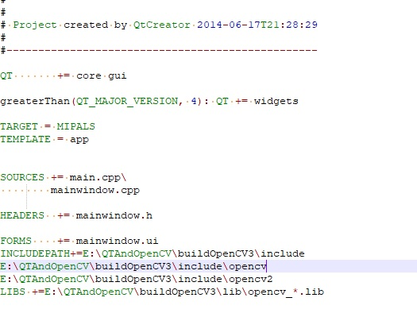
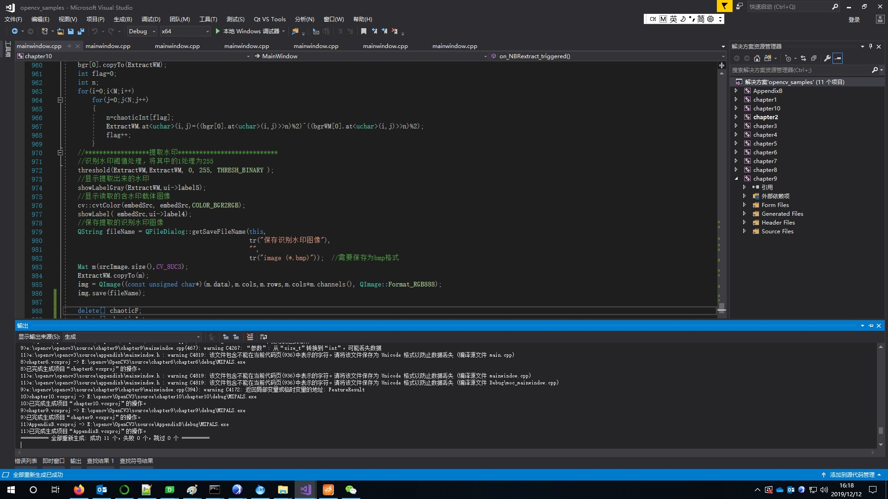

# my_opencv_examples
## 本例子来自<OpenCV编程案例详解>这本书，作者是李立宗。
    看到单位有这本书，花了一周时间撸了一遍，内容比较基础，高手就不要下载了。因为该书作者未提供源码下载地址，而且写邮件作者也没回，所以我从csdn花了5个点下载了源码。配置了vs2017 QT环境，修改了全部bug，全部编译通过，可以正常运行。 
    
## 该源码内容
   * 1.图像处理系统
   * 2.医学图像处理算法学习系统
   * 3.图像边缘检测学习系统
   * 4.数字加密图像学习系统
   * 5.手写数字识别学习系统
   * 6.骰子作画学习系统
   * 7.滤镜效果学习系统
   * 8.盲数字水印学习系统
   * 9.图像检索系统
   * 10.非盲数字水印学习系统

## 环境搭建
   ### 1.安装插件
   vs2017插件因为墙可能安装不上，所以qt-vsaddin-msvc2017-2.4.2-rev.09.vsix 直接安装即可。
   ### 2.qtcreater
  qt-opensource-windows-x86-5.13.2.exe，主要是安装编译器。因为该代码是使用QT开发的界面，其他项目如果不使用QT的话，当然不需要下载QT，直接使用opencv配置好目录，lib库就可以了。
  ### 3.安装opencv
  下载 opencv3.4.8解压缩皆可，配置的时候要用到opencv目录。
  
## 配置如图：
          
  
## 编译如图：
     
